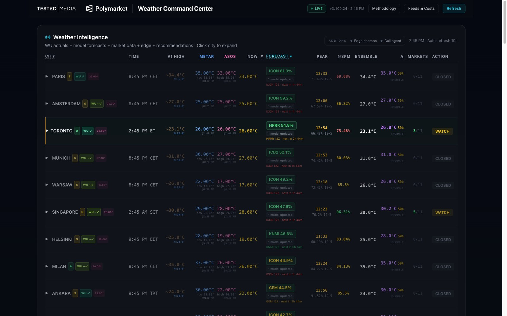
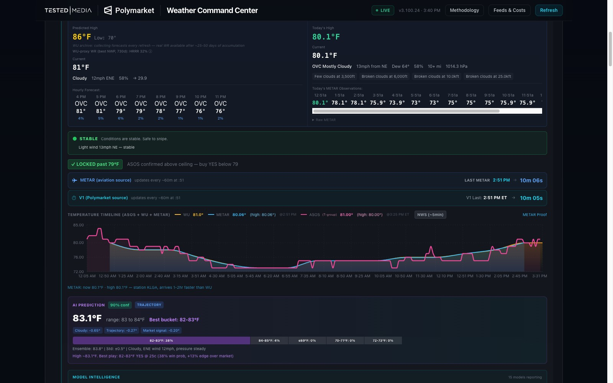
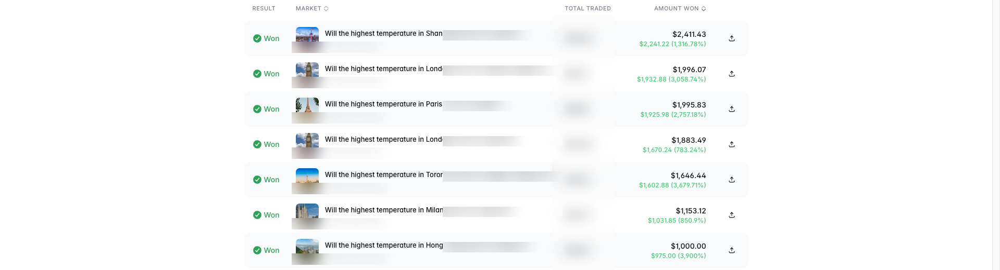
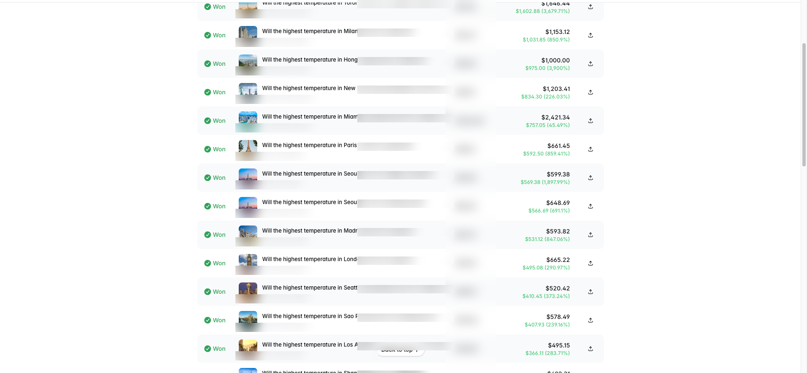
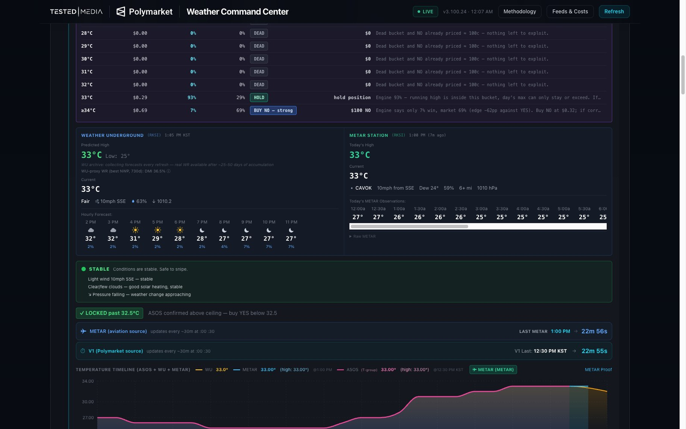
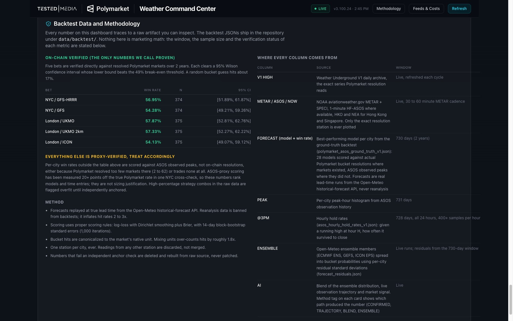
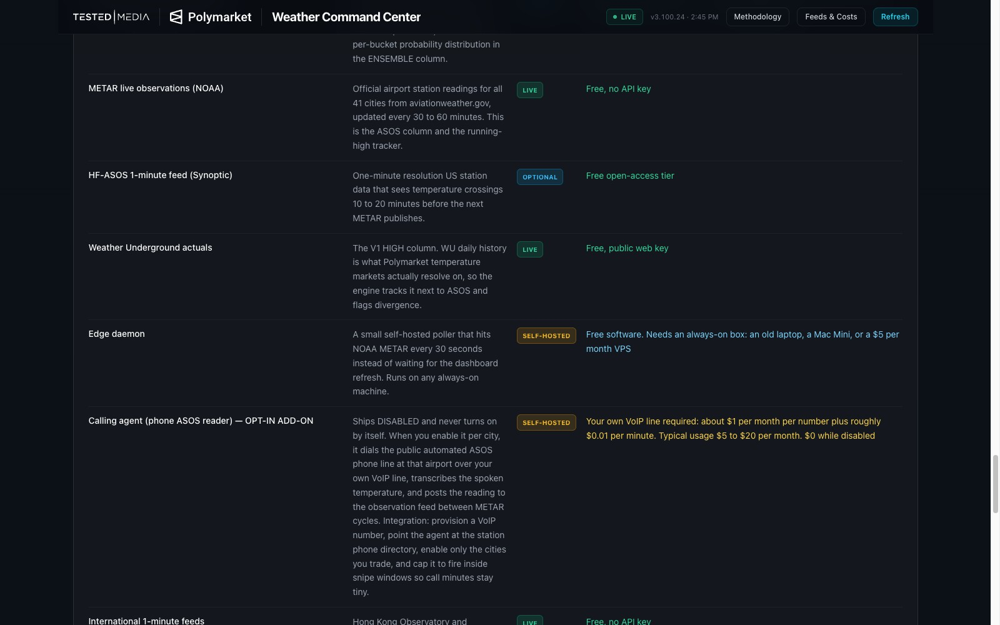
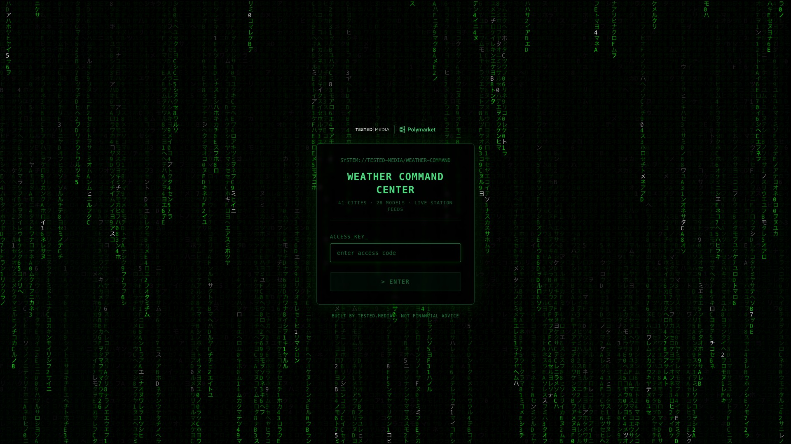

# Polymarket Weather Command Center

**Polymarket temperature markets resolve on a physical sensor at an airport. You can watch that sensor in real time. That is the entire edge, and this is the command center built around it.**

[](LICENSE)
[](https://github.com/testedmedia/polymarket-weather-command-center/stargazers)
[](data/backtest/)

Multi-model forecasts, live ASOS/METAR station observations, per-bucket probabilities and edge vs market price across 41 cities. Every win-rate claim in this README recomputes from the raw backtest data shipped in this repo.





## Results

Closed winning positions from the account trading on this exact dashboard. Wins are shown in full; some position details are redacted for account privacy. These are the biggest winners, not the complete history: losses exist and the account trades hundreds of these markets.

| Market | Profit | Return |
| --- | --- | --- |
| Shanghai temperature bucket | $2,241.22 | 1,316.78% |
| London temperature bucket | $1,932.88 | 3,058.74% |
| Paris temperature bucket | $1,925.98 | 2,757.18% |
| London temperature bucket | $1,670.24 | 783.24% |
| Toronto temperature bucket | $1,602.88 | 3,679.71% |
| Hong Kong temperature bucket | $975.00 | 3,900.00% |

Profit and return are Polymarket's reported net figures, which include partial exits and averaged fills. Past performance is not a guarantee of future results; see the disclaimer at the bottom.




## What this is

Polymarket runs daily markets like "Will the highest temperature in NYC be between 80-81°F today?". Each city-day typically has 7 mutually exclusive buckets (one lower tail, five 2-degree middles, one upper tail). The markets resolve on Weather Underground's daily maximum for one specific airport station.

That gives you three exploitable facts:

1. **The resolution source is a physical sensor you can watch.** The airport's ASOS station publishes METAR readings every 30 to 60 minutes, 1-minute feeds exist for US stations, and US airports expose a public automated phone line reading the same sensor. When the day's high is already in and the temperature is falling, buckets above the running high are dead, and the engine treats their NO side as near-certain.
2. **Numerical weather models disagree, and some are reliably better per city.** HRRR is strong for NYC, UKMO for London. The dashboard runs up to 28 models per city and knows each model's verified hit rate.
3. **The market is often priced away from the model consensus.** When the ensemble says a bucket is 47% and the market prices it at 14¢, that is a 33-point edge.

The Command Center fuses all three into one table: what the models say, what the sensor says right now, what the market is pricing, and where the edge is.

## How to read the dashboard

### Main table, column by column

| Column | Meaning |
| --- | --- |
| **CITY** | City plus grade chip (S/A/B/C/D: operator grade of historical tradeability, heuristic not artifact-derived) and the WU verification badge. Click any row to expand the full city card. |
| **TIME** | Local time at the station. Markets resolve on the station's local calendar day. |
| **V1 HIGH** | Today's running maximum from the Weather Underground V1 archive, the number the market actually resolves on. The small V3 and M values are cross-checks from WU's live API and METAR. |
| **METAR** | Latest official airport observation (temperature, today's METAR high, WU comparison, timestamp). |
| **ASOS** | The resolution sensor's reading and today's high from the 1-minute/hourly ASOS feed. |
| **NOW** | Current temperature with trend arrow (rising or falling). |
| **FORECAST** | The best model for this city right now, with its live probability of hitting the leading bucket, plus model run freshness (for example "HRRR 12Z, next in 5h"). Below it, the COMBO line shows the stacked-signal strategy: when the combo models for a city all agree on the same bucket, the combined call historically wins at a higher rate than any single model (730-day combo backtest, ASOS-proxy). The line turns green with FIRING when the members agree today; otherwise it reads pending or disagreement. Combo rates are ASOS-proxy watchlist evidence (see Backtest data), rendered only when the 95% CI lower bound clears 50% on the combo’s actual fire-day sample. Click the column header to sort by win rate. |
| **PEAK** | Projected time of today's peak plus historical peak-time distribution for this city and hour. |
| **@3PM** | Probability the daily high is already locked in by mid-afternoon (hold rate). |
| **ENSEMBLE** | Ensemble-weighted peak temperature and the probability mass on the leading bucket. |
| **AI** | The engine's blended prediction (models + observations + residuals). |
| **MARKETS** | How many of the 7 buckets are still alive vs killed by the running high. |
| **ACTION** | The recommendation: WATCH (edge forming), SKIP (no edge), plus BUY/FADE states when the engine sees a priced-in mistake. |

### The expanded city card




Click a city row to open the full card:

- **Peak bar:** today's confirmed peak, current reading, and typical peak time for this station.
- **Live Bucket Strip:** every bucket with market YES price, engine probability, market implied probability, the bet call (BUY YES, BUY NO, SKIP) and sizing math per $100. The "why" column explains each call in one sentence.
- **Weather Underground vs METAR panels:** side-by-side actuals from the resolution source and the aviation feed, so you see divergence before the market does.
- **Temperature timeline:** intraday chart of WU and METAR readings against bucket edges.
- **Stability assessment:** plain-English danger signals decoded from the raw METAR (gusts, frontal passage, rain cooling, pressure trend).
- **Model intelligence:** every model's current forecast for today and tomorrow with per-model verified win rates.

### Status logic worth knowing

- **FADE LOCK:** the day's high is confirmed and the temperature has been declining for 2 or more hours (or it is past 17:00 local). Buckets above the running high are dead; the engine flags near-certain NO opportunities (subject to the WU-vs-ASOS divergence audit).
- **EDGE DAEMON DOWN:** the optional self-hosted 30-second METAR poller is offline. Forecasts are unaffected; you just fall back to slower observation cadence.
- **CALL AGENT · ADD-ON:** the optional phone reader (see the dedicated section below). The chip links to its spec; it is never on by default.

## Data sources explained

**ASOS (Automated Surface Observing System)** is the physical weather station at the airport, owned by NOAA/FAA. It measures once a minute. This is the sensor whose daily maximum ends up in Weather Underground and therefore decides the market.

**METAR** is the aviation weather report format that ASOS publishes every 30 to 60 minutes (plus SPECI specials when conditions change fast). Free from aviationweather.gov with no key. The dashboard decodes raw METAR including the T-group (temperature to 0.1°C precision) and change groups (BECMG/TEMPO) for incoming weather.

**Weather Underground V1 archive** is what Polymarket resolution actually reads. WU ingests the same ASOS data but occasionally disagrees with the raw feed (station mixups, rounding, DST edge cases). The dashboard tracks both and flags divergence, because a WU-vs-ASOS gap is either a risk or an opportunity.

**Model forecasts** come from Open-Meteo: GFS, HRRR, ECMWF, UKMO, ICON, GEM, ARPEGE, JMA and more, up to 28 per city, plus ensemble members (ECMWF ENS, GEFS, ICON EPS) for the probability distribution.

One hard rule inherited from production: **never mix stations.** Every reading on a city's timeline comes from that city's exact resolution station (KLGA for NYC, not KJFK). A delayed correct reading always beats a fast wrong one.

## Backtest data



The complete 2-year artifact set ships in [`data/backtest/`](data/backtest/). Every headline statistic is derivable from these shipped aggregates (hits, attempts, rates per city and model); the per-day resolution rows ship with the engine release:

- `polymarket_asos_ground_truth_v1.json`: per-city, per-model bucket hit rates over a 730-day window. 28 models, 41 cities. Each entry carries `asos_exact`, `asos_within1` and `pm_bucket` (hits, attempts, rate); `pm_bucket` is scored against actual Polymarket bucket resolutions. Built from the Open-Meteo historical-forecast API (real lead-time forecasts, not reanalysis).
- `wu_backtest_41cities_v1.json`: the same exercise scored against Weather Underground daily maxima (the resolution series).
- `asos_strategy_overlay_v1.json`: the 3-model COMBO strategies per city, with per-combo fire-days and win rates. Source of the COMBO line on the dashboard (significance-gated at render time).
- `forecast_residuals.json`: per-city, per-model forecast error standard deviations that spread point forecasts into bucket probabilities.
- `asos_hourly_hold_rates_v1.json`: for every hour 0 to 23, how often a running high survived to close (728 days, 400+ samples per hour). Source of the @3PM column.
- `asos_fade_lock_v1.json`: per-city peak-hour and decline statistics behind the FADE LOCK logic.
- `buynosafe_audit_17cities_v1.json`: WU-vs-ASOS resolution audit; which cities never resolved below the ASOS reading over the window.
- `asos_wu_all_cities_verify.json`: station-level WU-vs-ASOS cross-verification, including the London divergence (382 mismatched days of 730) that drives the UNRELIABLE flag.
- `bias_adjusted_polymarket_v5_train.json` / `_validate.json`: train and validation splits for the bias-adjusted scoring experiment (+1.62pp validated lift over baseline).

### Headline verified numbers

The gate: at least 300 resolved markets AND a 95% Wilson confidence interval whose lower bound beats 49%. The shipped artifact also contains smaller-sample passes (Dallas/GFS-HRRR 66.4% at n=125 is the best number in the file); they stay off this table because n below 300 has not survived a full regeneration cycle yet. They are in the JSON; check them yourself.

These bets are verified against resolved Polymarket market outcomes over the 2-year window, computed from the exact artifact shipped in this repo (`per_city_model[city][model].pm_bucket`). All clear the gate. On break-even: 49% approximates break-even for buying a bucket at even-money pricing net of spread; at the sub-10¢ entries shown in the results section, break-even is far lower, so the gate is deliberately conservative:

| Bet | Win rate | n | 95% CI |
| --- | --- | --- | --- |
| London / UKMO | **60.05%** | 438 | [55.39%, 64.53%] |
| London / UKMO 2km | 59.13% | 438 | [54.47%, 63.64%] |
| London / ICON | 57.53% | 438 | [52.86%, 62.08%] |
| NYC / GFS-HRRR | **55.73%** | 436 | [51.04%, 60.33%] |

NYC / GFS (52.98%, n=436, CI lower bound 48.3%) passed on an earlier snapshot and was demoted when the regenerated backtest dropped its lower bound below the gate. Bets get demoted when the data says so; that is the gate working.

Do not trust this table, recompute it:

```bash
node scripts/verify-backtest.mjs
```

It reads the shipped artifact and reprints every bet that passes the gate, with Wilson confidence intervals. The output must match the table above exactly.

For context: a uniform-random guess over 7 buckets is 14.3%, and the empirical base rate of a single bucket call landing across this backtest is about 17% (outcomes are not uniform). A model picking the right 2-degree bucket 55 to 60% of the time, priced against a market that often has the same bucket in the teens, is the whole edge.

### Why the table is short (read this before trading)

The backtest philosophy here is aggressively conservative, and that is the most valuable part of this repo:

- Only 4 bets currently survive direct verification against resolved Polymarket outcomes. Everything else is quarantined.
- The other 38 cities with Polymarket series resolved between 0 and 125 markets each in the window. None clears the n-at-least-300 gate; a few (Dallas, Toronto) pass the CI check on small samples and sit on a watch band inside the artifact.
- Strategy combos that backtest at 74 to 88% (Helsinki, Amsterdam, Busan) are ASOSproxy numbers, not Polymarket resolutions, and are treated as overfit until proven otherwise. One earlier NYC cross-check showed ASOS-exact scoring can be 20+ points off from the actual Polymarket rate because of station mismatch.
- Scoring uses proper scoring rules (log-loss with Dirichlet smoothing, Brier) with block-bootstrap standard errors, not cherry-picked win streaks.

If a number is not in the table above, treat it as unverified.

## The calling agent (optional add-on, disabled by default)

US airports publish their ASOS readings on a public automated phone line. Between METAR cycles (30 to 60 minutes), that public phone line is the fastest publicly available read of the exact sensor the market resolves on. The calling agent automates it.

How it works:

1. You provision a VoIP number on your own account (Twilio, Telnyx or similar).
2. The agent dials the target station's ASOS line, listens to the automated broadcast, and transcribes the spoken temperature.
3. The reading is posted into the live observation feed with a `phone` source tag, and the dashboard's running-high and bucket-kill logic pick it up immediately.

Ground rules baked into the design:

- **Disabled by default.** Nothing dials until you explicitly enable it, per city.
- **Scoped firing.** Enable it only inside snipe windows (the 20 to 35 minutes before a METAR publishes near a bucket edge) so a month of usage stays in the $5 to $20 range.
- **Station discipline.** Readings are only accepted from the exact resolution station. A fallback airport answering the wrong line gets discarded, never merged.
- **Auto cut-off.** The reference implementation shuts the daemon off at night local time; readings would not move markets that are already settled.
- **Shared resource discipline.** These lines exist for pilots. Check your carrier’s acceptable-use policy and keep volume to a handful of short calls per day per city. US stations only; international ASOS phone equivalents do not exist.

## What it costs to run

| Feed / agent | Status | Cost |
| --- | --- | --- |
| Polymarket Gamma + CLOB APIs | Core | Free, no key |
| Open-Meteo multi-model forecasts | Core | Free tier: 10,000 calls/day, non-commercial use only (all endpoints). Commercial: Standard 29€/month (forecast only), Professional 99€/month (adds ensemble + historical). A trading stack is commercial use |
| Open-Meteo ensemble members | Optional | Commercially: requires the Professional plan (99€/month), not Standard |
| NOAA METAR (aviationweather.gov) | Core | Free, no key |
| Synoptic HF-ASOS 1-minute feed | Optional | Free open-access tier |
| Weather Underground actuals | Core | Free (reads WU public website data; no commercial API contract, review weather.com terms) |
| HKO + Singapore NEA 1-minute feeds | Core | Free |
| Edge daemon (30s METAR poller) | Optional, self-hosted | Free software; needs an always-on box (~$5/month VPS) |
| Calling agent (phone ASOS reader) | Opt-in add-on, disabled by default, US stations only | Your own VoIP line ~$1/month + ~$0.01 to $0.014/minute; typical $5 to $20/month; $0 while disabled |
| Failover chain (Tomorrow.io, Visual Crossing, WeatherAPI.com) | Optional | Free tiers; paid from ~$25 to $99/month |
| Hosting (Vercel) + Postgres (Supabase) | Core | Free tiers cover the workload (check non-commercial-use restrictions); Pro tiers $20 + $25/month |
| Telegram alerts | Optional | Free |

**Bottom line:** minimal stack $0/month (non-commercial free tiers; a for-profit trading stack should assume commercial licensing). Serious stack (Open-Meteo Professional at 99€/month plus an always-on box) about $110/month. Full stack with the calling agent and paid failover $115 to $150/month. Prices are typical published rates, verify before subscribing.



## Roadmap

- **Demo mode**: bundled sample payload so `npm run dev` renders a full dashboard with no engine (top priority, see issues)
- **Engine release**: forecast cron, observation ingest, ensemble ingest, shadow scoring, Supabase schema
- docker-compose for self-hosters who skip Vercel
- Kalshi temperature markets alongside Polymarket

## Running it yourself

This app is the Command Center UI plus a thin read-only proxy. It renders the weather-intel payload produced by the forecast engine (a 15-minute cron that fans out to every source above and assembles per-city intelligence).

```bash
npm install
npm run dev                  # http://localhost:3210 — DEMO MODE, no env vars needed
```

### Demo mode

With no `.env.local` at all, `npm run dev` runs in **demo mode**: the proxy route (`app/api/brain/trading/[[...path]]/route.ts`) serves a bundled synthetic sample payload from `lib/demo-data.ts` instead of proxying to a real engine, so every panel — all 41 cities, buckets, model intelligence, positions, scorecards, the sniper bot panel — renders populated on first run. A yellow banner marks it clearly as sample data; nothing in demo mode is a real trade or a real balance. The 4 verified win rates it shows for the scorecard are the same real, published numbers from the "Headline verified numbers" table above — everything else (positions, trades, PnL, bot status) is fabricated to exercise the UI, not a claim about real performance.

This unblocks evaluating the whole dashboard without the forecast engine, which isn't open-sourced yet.

To connect a real engine instead:

```bash
cp .env.example .env.local   # point UPSTREAM_BASE at your engine, set UPSTREAM_SECRET
npm run dev
```

Environment variables:

| Var | Purpose |
| --- | --- |
| `UPSTREAM_BASE` | Base URL of the engine that serves `/api/brain/trading?type=weather-intel`. Unset = demo mode. |
| `UPSTREAM_SECRET` | Bearer token the proxy sends to the engine (server-side only, never shipped to the browser) |
| `DEMO` | Optional override. `DEMO=1` forces demo mode on even with `UPSTREAM_BASE` set; `DEMO=0` forces it off (upstream failures surface as real 502s instead of falling back to sample data) |

The full engine is being packaged as a follow-up release (see Roadmap). The payload schema the UI consumes is fully visible in `app/page.tsx` types.

## PWCC Webhook variant: push-first observation ingestion

This fork adds a narrow **observation-only, push-first** engine. It preserves the existing `weather-report` and `weather-intel` payload contracts, while forecast, market, position and strategy panels retain their existing demo/proxy behaviour. Every record must carry the exact station in `STATION_REGISTRY`; the implementation will never substitute an airport, including **KBKF** for Denver.

> **Current account status:** the Xweather account has Weather API Observations access but is on the Free plan and does not show a Webhooks entitlement. Xweather documents Webhooks as a separate premium subscription. The endpoint below is complete and configurable, but no real Xweather delivery can be registered or end-to-end verified until that subscription and vendor-specific registration details are supplied.

| Policy | Implemented behaviour |
| --- | --- |
| Webhook primary path | `POST /api/webhooks/xweather` accepts Xweather Weather API-style observation payloads, requires an exact configured ICAO, accepts only newer `reportTime`, and makes Webhook win when report times tie. It updates only the delivered station. |
| Validation | The handler reads the original body, supports constant-time HMAC-SHA256 comparison, an optional fixed token header, configurable header/prefix names, optional URL challenge response, JSON checks and a 1 MB body limit. Environment variables remain unset until Xweather supplies its actual protocol. |
| Deduplication | The last 10 delivery IDs/hashes are retained in memory, as requested. Duplicates receive an idempotent `200`; malformed/unknown-station payloads receive a non-retryable `202`; invalid authentication receives `401`. |
| Stale delivery | A report older than 69 minutes is accepted only as an observable anomaly and starts a best-effort exact-station polling verification. It is never promoted to the live observation. |
| Silent fallback | At every API schedule slot (`00, 02, 05, 07, 11, 13, 30, 32, 35, 37, 41, 43` in `Asia/Shanghai`), only stations without a current-instance Webhook record newer than 120 minutes are polled. |
| Polling chain | Xweather batch calls use at most five exact ICAO subrequests per batch. If unavailable, the only public fallback is [AviationWeather.gov Data API](https://aviationweather.gov/data/api/) with `hours=2`, then a strict 69-minute freshness check. |
| Storage | This round intentionally uses **ephemeral in-memory state only**. Vercel cold starts or instance replacement clear Webhook event IDs, raw payloads, observations, alerts and logs. Long-term history and reliable cross-instance 120-minute silence detection require persistent storage in a future round. |

### Environment and deployment

```bash
cp .env.example .env.local
# Set WEATHER_ENGINE_ENABLED=1 plus XWEATHER_CLIENT_ID / XWEATHER_CLIENT_SECRET
npm install
npm run typecheck
npm run build
```

After Xweather enables the premium product, register the Vercel production callback:

```text
https://pwcc-webhook-readonly-audit-2026082.vercel.app/api/webhooks/xweather
```

Set the vendor-supplied authentication details in the Vercel project environment using the variables documented in `.env.example`; do not commit any credentials. `GET /api/webhooks/xweather` is the readiness/challenge endpoint, `/api/weather/poll` is the station-level fallback, and `/api/weather/health` exposes current-instance logs, alert state, source outcomes and silent stations.

> **Quota warning.** With 41 stations and at most five stations per Xweather batch, a full fallback poll makes nine Xweather batch HTTP requests before any public-source fallback. The in-memory health endpoint records `X-Cost-*` and `X-RateLimit-*` headers. Verify actual Xweather dashboard usage before enabling production Cron, because batch billing may be based on subrequests rather than one HTTP request.

### Deferred next-round work

- Add a durable database/KV for permanent raw delivery retention, N=10 idempotency records, accurate cross-instance silence detection and daily highs.
- Fill in Xweather's actual Webhook subscription configuration, endpoint registration/challenge process, signing header and delivery schema after the premium product is active.
- Add forecast/model ingestion so standalone live payloads cover all non-observation dashboard panels.

## If this saved you time

If the backtest data or the source saved you research hours, a star helps other traders find it.

[](https://github.com/testedmedia/polymarket-weather-command-center/stargazers)

## Access

The hosted instance is gated behind an access key.



## Disclaimer

This is research tooling, not financial advice. Prediction markets can lose your entire stake. The verified win rates above are historical, measured over one specific 2-year window, and can decay as markets get more efficient. Trade sizes in the screenshots are not recommendations. Do your own verification; the raw data is in this repo so you can.
